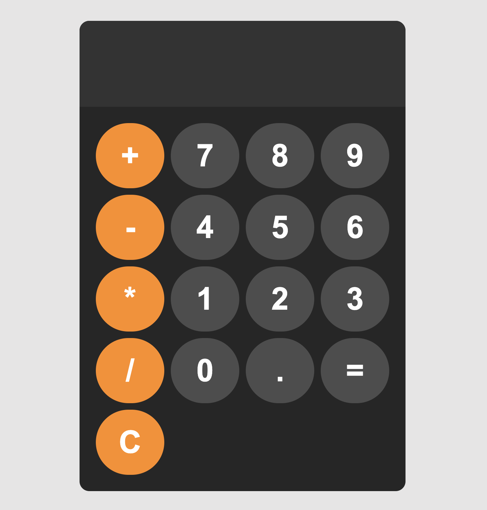

# Calculadora Simples

Fiz esse famoso projeto de calculadora para praticar as funcionalidades do **JavaScript**, incluindo manipulação do DOM, eventos e execução de cálculos matemáticos.

## Tecnologias Utilizadas

- **HTML**: estrutura do projeto
- **CSS**: estilização da interface
- **JavaScript**: funcionalidades e interatividade

## Funcionalidades

- Adição de números e operadores ao display
- Execução de cálculos matemáticos
- Botão de limpeza do display
- Interface responsiva
- Mensagem de Erro caso a operaçao nao seja digitada corretamente (ex: 1+=)

## Como Executar o Projeto

   Acesse via: [https://github.com/seu-usuario/nome-do-repositorio.git](https://yvasques.github.io/calculator_js/)

## Melhorias Futuras

- Melhor tratamento de erros nas expressões matemáticas
- Melhorar a estilização e usabilidade
- Adicionar suporte a teclado

Sinta-se à vontade para contribuir e sugerir melhorias! 🚀

